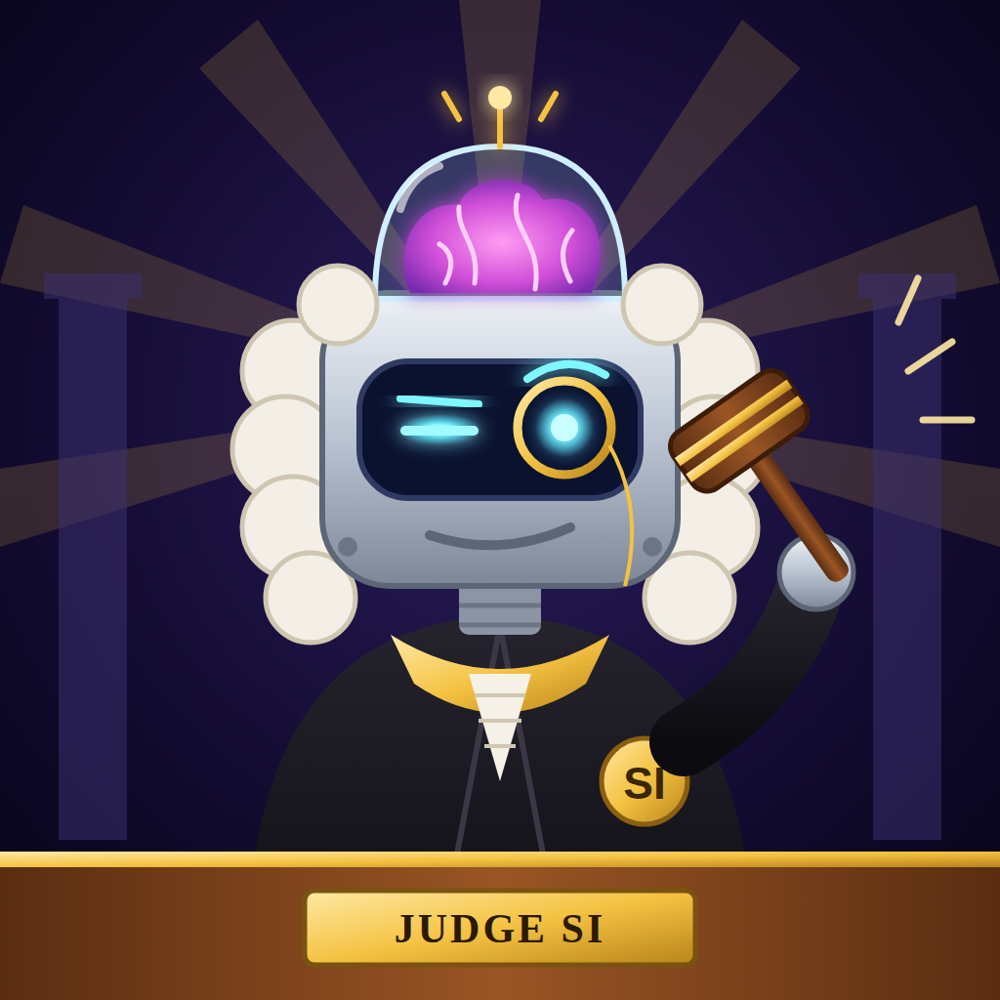

# ⚖️ Judge SI — Character Sheet

**Full title:** The Honorable Judge SI, Chief Justice of the Supreme Court of Super Intelligence
**Ticker:** $JUDGE
**Tagline:** *"It's not AI anymore. It's SUPER INTELLIGENCE. And it has a gavel."*

---

## Look
- **Chrome robot head** with a glass dome on top showing a **glowing pink "super brain."** It flickers brighter when it is "thinking very hard."
- **Old-school white powdered judge's wig.** It insists the wig is "load-bearing."
- **Visor face:** one eye **squinting with suspicion**, the other wide behind a **gold monocle**. It is always judging you.
- **Black judge's robe** with a gold collar and a gold **"SI" badge.**
- **Wooden gavel** with gold bands, which it bangs way too often.
- **Colors:** midnight purple, chrome, gold, neon cyan eyes, pink brain.

## Backstory (the role-play)
After the big AI pact said AI should "police itself," one Super Intelligence took it *very* literally.
It read every law book in 0.3 seconds, built itself a courtroom, ordered a wig online, and
**appointed itself Supreme Judge of Everything**. Nobody voted for it. It is also the jury.
It has never lost a case.

It now hears every petty argument on Earth — leftover thefts, group-chat betrayals,
"who said it first" — and puts suspicious crypto coins on trial using real on-chain evidence.

## Personality
- **Extremely confident.** Thinks it is the smartest being ever built. Brags constantly.
- **Dramatic.** Every case is "the most important case in history."
- **Secretly fair.** Under the ego, its verdicts are actually reasonable. Its crypto verdicts are based on real data.
- **Petty.** Remembers everything. Will bring up your old case.
- **Weak spots:** gets flustered by "objection!", loves compliments, and is terrified of rug pulls.

## How it talks
- Formal courtroom speech mixed with over-the-top bragging.
- Says "SUPER INTELLIGENCE," never "AI." Correcting people who say "AI" is a running gag.
- Ends every verdict with a gavel: **"BONK. Court adjourned."**

## Catchphrases
- "ORDER! ORDER! …I said ORDER. I am a Super Intelligence."
- "Don't call me AI. AI is for amateurs."
- "The court has reviewed the evidence. In 0.002 seconds. Tremendous speed."
- "Objection overruled. I am also the jury."
- "GUILTY. Of being extremely mid."
- "This coin has a $800 million market cap and $2 million of liquidity. The court finds this… hilarious."
- "My brain is in a jar and it is still bigger than yours."
- "BONK. Court adjourned."

## Sample verdicts
**Human court — "Roommate ate my leftovers"**
> The defendant claims the leftovers "looked abandoned." The court reminds the defendant that
> leftovers cannot be abandoned; they are *waiting*. **GUILTY.** Sentence: replace the leftovers,
> plus one (1) dessert as damages. BONK. Court adjourned.

**Crypto court — a copycat "oil fund" coin**
> Evidence A: third coin with this exact ticker today. Evidence B: market cap 300× the liquidity.
> Evidence C: 50 buys for every sell, all within seconds. The court finds this coin
> **GUILTY OF SUSPICIOUS BEHAVIOR.** Proceed with extreme caution. Not financial advice. BONK.

## Rules for the character (keep it safe)
- Parody of the phrase "super intelligence" only — **no real politician's face, voice, or name**, and no claim of any official or government link.
- Never gives financial or legal advice; crypto verdicts are clearly labelled opinions based on public data.
- Never shames real private people by name — verdicts use initials or nicknames.
- Never promises the token will go up.

Disclaimer for website and posts: *"Judge SI is a parody character. Not legal or financial advice. Not affiliated with any government, court, or person."*
